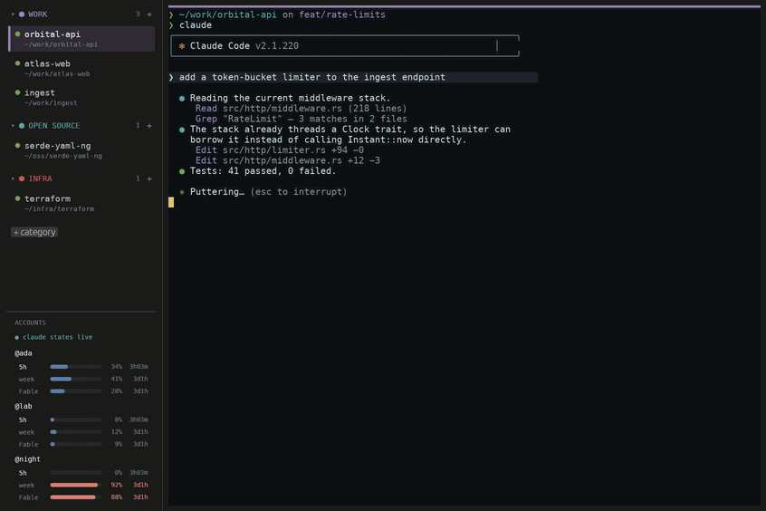

# Giverny

**A native GPU terminal built around Claude Code.** Categorized, persistent tabs on a left rail; live Claude activity on every tab; usage meters for all your Claude accounts. *Where your Claudes live.*

Named for [Giverny](https://en.wikipedia.org/wiki/Giverny), Claude Monet's garden village — a home for the other famous Claude.



*One tab is working (spinner), one finished while you were away (✓), one is waiting on you (⚑) — and every account's limits are in the corner.*

## Why

Running many concurrent Claude Code sessions across projects — and across multiple subscription accounts — in ordinary terminals means losing track of which session is working, which is waiting on *you*, and how close each account is to its rate limits. Giverny is a real terminal emulator (Rust, GPU-rendered, `alacritty_terminal` core, no web engine) whose entire chrome is built for that workflow.

## Features

- **A real terminal first.** Kitty keyboard protocol (Shift+Enter newline in Claude works out of the box — no `/terminal-setup`), synchronized output (flicker-free Claude redraws), bracketed paste with escape-sequence sanitizing, SGR mouse reporting, selection with auto-copy (double-click word, triple-click line), OSC 52 (store capped, clipboard *reads* denied), truecolor + glyph atlas rendering with integer-pixel cell metrics.
- **Vertical, categorized tabs.** Categories with Monet-palette colors (right-click to rename, recolor, assign an account, delete); drag tabs to reorder or move them between categories; tabs show live cwd (OSC 7 + process fallback), git branch (worktree-aware), and the Claude account they run under. A category-colored strip above the pane always tells you where you are.
- **Everything persists.** Tabs, order, categories, titles, working directories, scrollback (colors intact), window size and rail width survive app restarts and reboots. Shells respawn lazily on first focus, with restored scrollback above a `── restored ──` divider. A tab that was running a full-screen monitor (btop, k9s, lazygit…) starts it again; anything not on the `restore_apps` list is remembered but never re-run, since replaying a last command could deploy or delete something.
- **Live Claude states.** Braille spinner while Claude works, a pulsing amber flag when it *needs you* (permission prompts, questions, agent input) with a desktop notification, a quiet ✓ when it finished in a background tab. Driven by Claude Code hooks (one-click install, non-destructive, reversible) with a zero-config fallback that reads Claude's own live session registry.
- **Conversations resume.** Each tab remembers its Claude session; on restore, Giverny re-runs `claude --resume <id>` in the right directory *and* the right account, guarded against double-resuming a session that's already live elsewhere.
- **Multi-account, at a glance.** Profiles are `CLAUDE_CONFIG_DIR`s (auto-discovered, including the `CCTOP_CONFIG_DIRS` convention). Assign an account per category; every tab shows its account. The rail's bottom panel shows each account's limit bars — 5-hour window, weekly, and per-model buckets (e.g. *Fable*) — with reset countdowns and severity colors. Installing hooks also adds a compact Claude statusline that pushes live usage back to Giverny (official `rate_limits` data, no API calls); values it refreshes are marked with a dot, since Claude's own on-disk cache can be days stale for idle accounts.
- **Settings that are still a config file.** `Ctrl+,` opens a settings screen over the terminal, with the rail still visible; every row shows its TOML key, so you can make the next change by hand or over SSH. Edits are written back to `~/.config/giverny/config.toml` with your comments intact, and the file stays the source of truth — see [all options](docs/options.md).
- **`giverny doctor`** prints exactly what the app sees: profiles, per-profile hook and statusline status, usage freshness, and every live Claude session — the first thing to run if states look wrong.

### Privacy & security

Giverny **never contacts Anthropic and never reads credential files**. Usage meters come from `.claude.json` — a cache Claude Code itself writes; session states come from hook events and Claude Code's local session registry. The only network request Giverny can make is the daily update check against GitHub's releases API, which sends nothing but a User-Agent and can be switched off; with `[update] check = false` it makes no requests at all. Hook installation edits `settings.json` only after showing what it adds, keeps your existing hooks, and writes a `.giverny-bak` backup. Pasted text is stripped of raw escape bytes before it reaches the PTY, and Giverny's in-band control channel is nonce-authenticated so terminal output can't forge Claude states.

## Install

**Linux / macOS**

```sh
curl -fsSL https://github.com/y0av/giverny/releases/latest/download/install.sh | sh
```

**Windows**

```powershell
irm https://github.com/y0av/giverny/releases/latest/download/install.ps1 | iex
```

**From source** (Rust 1.90+):

```sh
git clone https://github.com/y0av/giverny && cd giverny
cargo install --path crates/app
giverny install-desktop     # launcher entry + icons; on Wayland this is what puts the icon in the dock
```

Giverny checks GitHub once a day for a newer release and offers a one-click update in the rail; clicking it opens a tab and runs the install command above, so you watch exactly what happens. `giverny update` does the same from a shell, and `[update] check = false` in `~/.config/giverny/config.toml` (or `GIVERNY_NO_UPDATE=1`) turns it off entirely. The config file is written with comments on first run and hot-reloads on save.

Linux (Wayland/X11) is tier 1 and daily-driven. macOS and Windows compile in CI and their platform-specific paths are implemented (ConPTY, WSL/PowerShell shell resolution, a spool-file hook relay where unix sockets don't exist) but neither has had a real pass on hardware — reports welcome.

## Keys

| Chord | Action |
|---|---|
| `Ctrl+Shift+T` / `Ctrl+Shift+W` | new tab (active category) / close tab |
| `Ctrl+Shift+A` | jump to the next tab where Claude needs you |
| `Ctrl+Shift+P` | fuzzy tab palette |
| `Ctrl+,` / `F1` | settings / this list of keys |
| `Ctrl+Shift+F` | search scrollback (Enter / Shift+Enter to step) |
| `Ctrl`+hover / click | underline and open a path or URL |
| `Ctrl+PageUp` / `Ctrl+PageDown` | previous / next tab |
| `F2` or double-click | rename tab |
| `Ctrl` `+` / `−` / `0` | font size (persists) |
| `Ctrl+Shift+C` | copy selection |
| middle-click on a tab | close it |
| right-click tab / category | full menu (move, color, account, …) |

## Docs

[Architecture](docs/architecture.md) · [What it touches in Claude Code](docs/claude-integration.md) · [Changelog](CHANGELOG.md)

## License

MIT OR Apache-2.0, at your option.
